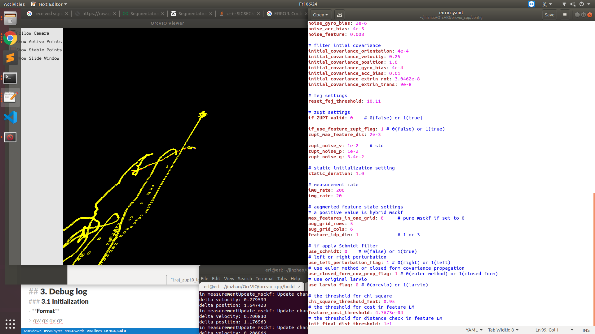
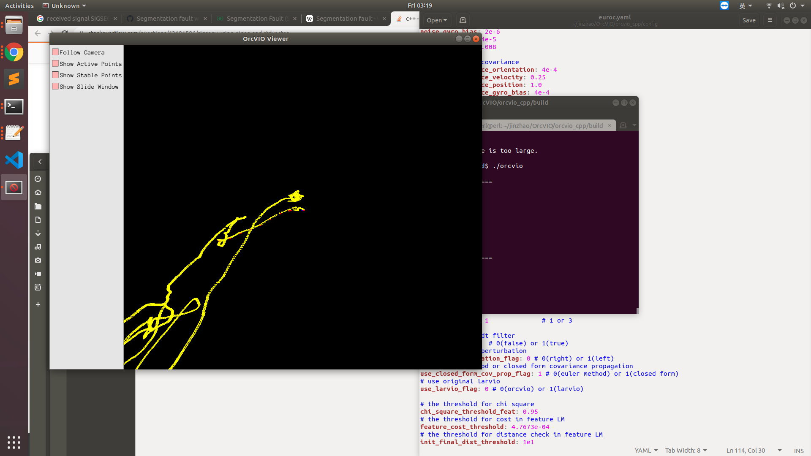

## 1. Packages & Tools
rpg_trajectory_evaluation: [https://github.com/uzh-rpg/rpg_trajectory_evaluation](https://github.com/uzh-rpg/rpg_trajectory_evaluation)

evo: [https://github.com/MichaelGrupp/evo](https://github.com/MichaelGrupp/evo)


## 2. Trajectory Eval
###  without ZUPT (if_ZUPT_valid=0)
|ZUPT = 0         |Debug (vscode)                 |Release                      |
|----------------|-------------------------------|-----------------------------|
|Left perturbation|||
|Right perturbation |||

## 3. Debug log
### 3.1 Initialization
- **Format**
> qw qx qy qz 
> vx vy vz 
>px py pz

- **Left Perturbation & Release Build** [file link](traj_zupt0_left_release/orcvio_state_track.txt)
```
0.388817 -0.597162 -0.585514 -0.386514
0.0116657 0.0702375 0.772233
0 0 0
```

- **Right Perturbation & Release Build** [file link](traj_zupt0_right_release/orcvio_state_track.txt)
```
0.388817 -0.597162 -0.585514 -0.386514
0.0116657 0.0702375 0.772233
0 0 0
```

- **Left Perturbation & Debug Build** [file link](traj_zupt0_left_vsdebug/orcvio_state_track.txt)
```
0.387677 -0.598549 -0.586216 -0.384442
0.0124409 0.073509 0.776809
0 0 0
```

- **Right Perturbation & Debug Build** [file link](traj_zupt0_right_vsdebug/orcvio_state_track.txt)
```
0.387677 -0.598549 -0.586216 -0.384442
0.0124409 0.073509 0.776809
0 0 0
```

- **Summary**
Same build mode would produce the same initialization.

### 3.2 First prediction
- **Left Perturbation & Release Build** [file link](traj_zupt0_left_release/orcvio_state_track.txt)
```
initialization 0 0
0.388817 -0.597162 -0.585514 -0.386514
0.0116657 0.0702375 0.772233
0 0 0

predict 0 1
0.388817 -0.597162 -0.585514 -0.386514
0.0116657 0.0702375 0.772233
0 0 0

update 0 2
0.388817 -0.597162 -0.585514 -0.386514
0.0116657 0.0702375 0.772233
0 0 0

predict 0.0999999 3
0.391195 -0.591021 -0.579688 -0.402023
-0.0135618 0.0496168 0.726194
-0.000514802 0.00611583 0.0755406

update 0.0999999 4
0.391195 -0.591021 -0.579688 -0.402023
-0.0135618 0.0496168 0.726194
-0.000514802 0.00611583 0.0755406
```

- **Right Perturbation & Release Build** [file link](traj_zupt0_right_release/orcvio_state_track.txt)
```
initialization 0 0
0.388817 -0.597162 -0.585514 -0.386514
0.0116657 0.0702375 0.772233
0 0 0

predict 0 1
0.388817 -0.597162 -0.585514 -0.386514
0.0116657 0.0702375 0.772233
0 0 0

update 0 2
0.388817 -0.597162 -0.585514 -0.386514
0.0116657 0.0702375 0.772233
0 0 0

predict 0.0999999 3
0.391195 -0.591021 -0.579688 -0.402023
-0.0135618 0.0496168 0.726194
-0.000514802 0.00611583 0.0755406

update 0.0999999 4
0.391195 -0.591021 -0.579688 -0.402023
-0.0135618 0.0496168 0.726194
-0.000514802 0.00611583 0.0755406
```

- **Left Perturbation & Debug Build** [file link](traj_zupt0_left_vsdebug/orcvio_state_track.txt)
```
initialization 0 0
0.387677 -0.598549 -0.586216 -0.384442
0.0124409 0.073509 0.776809
0 0 0

predict 0 1
0.387677 -0.598549 -0.586216 -0.384442
0.0124409 0.073509 0.776809
0 0 0

update 0 2
0.387677 -0.598549 -0.586216 -0.384442
0.0124409 0.073509 0.776809
0 0 0

predict 0.0999999 3
0.390092 -0.592338 -0.580401 -0.400124
-0.011322 0.0578097 0.730904
-0.000361555 0.00669463 0.076005

update 0.0999999 4
0.390092 -0.592338 -0.580401 -0.400124
-0.011322 0.0578097 0.730904
-0.000361555 0.00669463 0.076005
```
- **Right Perturbation & Debug Build** [file link](traj_zupt0_right_vsdebug/orcvio_state_track.txt)
```
initialization 0 0
0.387677 -0.598549 -0.586216 -0.384442
0.0124409 0.073509 0.776809
0 0 0

predict 0 1
0.387677 -0.598549 -0.586216 -0.384442
0.0124409 0.073509 0.776809
0 0 0

update 0 2
0.387677 -0.598549 -0.586216 -0.384442
0.0124409 0.073509 0.776809
0 0 0

predict 0.0999999 3
0.390092 -0.592338 -0.580401 -0.400124
-0.011322 0.0578097 0.730904
-0.000361555 0.00669463 0.076005

update 0.0999999 4
0.390092 -0.592338 -0.580401 -0.400124
-0.011322 0.0578097 0.730904
-0.000361555 0.00669463 0.076005
```
- **Summary**
Still, same build mode would produce the same first prediction.

### 3.3 Major different frames
#### 3.3.1 Same perturbation, different build mode
-  initialization are different, and...
- **Left perturbation:  Release vs Debug**
- **Right perturbation:  Release vs Debug**

#### 3.3.2 Same build mode, different perturbation
- **Release mode:  Left vs Right perturbation** (huge difference in the beginning)




- **Debug mode:  Left vs Right perturbation** (not very different)


## 4. Baseline
baseline (doing great) orcvio_euroc_cpp, test_vio branch: [https://github.com/moshanATucsd/orcvio_euroc_cpp/tree/test_orcvio](https://github.com/moshanATucsd/orcvio_euroc_cpp/tree/test_orcvio)=

[file link](traj_zupt0_left_larvio_release/orcvio_state_track.txt)

[file link](traj_zupt0_right_larvio_release/orcvio_state_track.txt)

- **Left Perturbation & Release** 
```
initialization 0 0 (predict 0 1) (update 0 2)
0.388817 -0.597162 -0.585514 -0.386514
0.0116657 0.0702375 0.772233
0 0 0

predict 0.0999999 3 (update 0.0999999 4)
0.391195 -0.591021 -0.579688 -0.402023
-0.0135618 0.0496168 0.726194
-0.000514802 0.00611583 0.0755406

predict 0.2 5
0.399304 -0.584905 -0.574871 -0.409837
-0.00291834 0.0359449 0.628479
-0.00200766 0.0104411 0.14287
```

- **Right Perturbation & Release** 
```
initialization 0 0 (predict 0 1) (update 0 2)
0.388817 -0.597162 -0.585514 -0.386514
0.0116657 0.0702375 0.772233
0 0 0

predict 0.0999999 3 (update 0.0999999 4)
0.391195 -0.591021 -0.579688 -0.402023
-0.0135618 0.0496168 0.726194
-0.000514802 0.00611583 0.0755406

predict 0.2 5
0.399304 -0.584905 -0.574871 -0.409837
-0.00291834 0.0359449 0.628479
-0.00200766 0.0104411 0.14287
```

- **Left Perturbation & Debug build** 
```
initialization 0 0 (predict 0 1) (update 0 2)
0.387677 -0.598549 -0.586216 -0.384442
0.0124409 0.073509 0.776809
0 0 0

predict 0.0999999 3 (update 0.0999999 4)
0.390092 -0.592338 -0.580401 -0.400124
-0.011322 0.0578097 0.730904
-0.000361555 0.00669463 0.076005

predict 0.2 5
0.398237 -0.586158 -0.575566 -0.408105
0.000529194 0.0485155 0.633232
-0.00156914 0.0120584 0.143808
```
- **Right Perturbation & Debug build** 
```
initialization 0 0 (predict 0 1) (update 0 2)
0.387677 -0.598549 -0.586216 -0.384442
0.0124409 0.073509 0.776809
0 0 0

predict 0.0999999 3 (update 0.0999999 4)
0.390092 -0.592338 -0.580401 -0.400124
-0.011322 0.0578097 0.730904
-0.000361555 0.00669463 0.076005

predict 0.2 5
0.398237 -0.586158 -0.575566 -0.408105
0.000529194 0.0485155 0.633232
-0.00156914 0.0120584 0.143808
```

